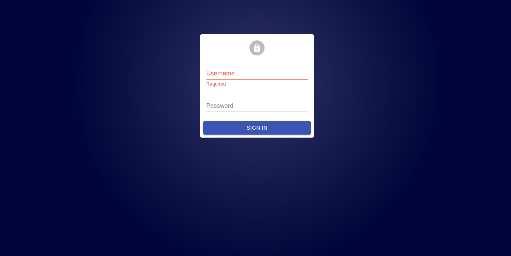
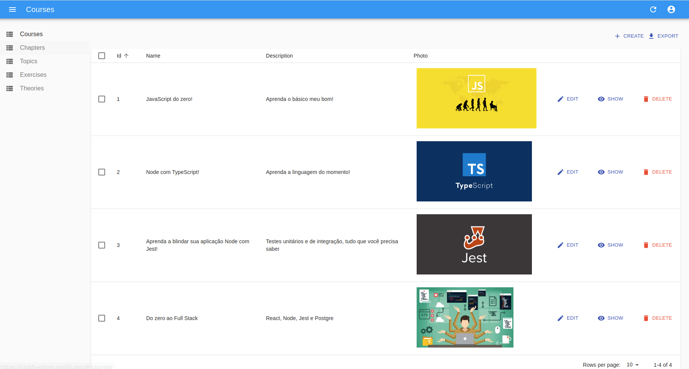

# Project - Admin Panel - Codify

  

  

## Objective

   This project was developed throughout the Bootcamp of "Respode Aí", is a  admin controller for a study platform where the students can learn the best way to be a developer watching videos and solving algorithms accord of his courses chose.

### Features
- [x] Courses CRUD 
- [x] Chapters CRUD 
- [x] Theories CRUD 
- [x] Exercises CRUD 
- [x] Admin authentication 

### Main Tech Stack
Languages: 

    
    
    
    

### Contributors
<a href="https://www.respondeai.com.br/">

 
<b>Responde Aí</b>
</a>

### Screen Shots

  

  

### Authors
---
Gabriel Pedro Braga Piazza.

 

Thiago Ribeiro Silva.

 

Herick Rossato Motta.

 

Lucas Nakandakare.

 

Vagner Pavani.

 

 
Made by, Get in Touch!  
